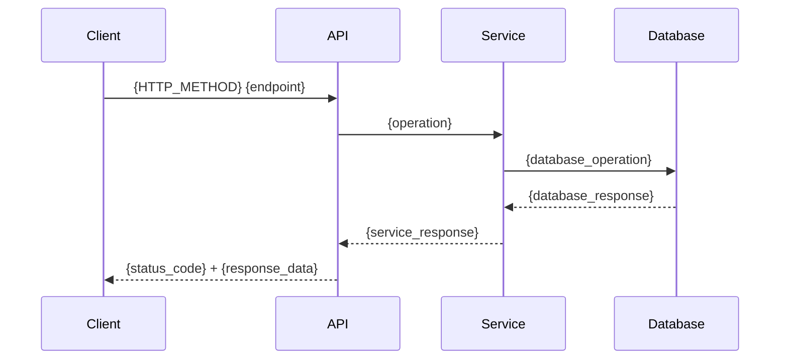

# API User Story

Template for creating detailed API user stories with acceptance criteria, API specs, and metrics.

## Objective (User Story)

**As** a {user_role},  
**I want** {specific_objective},  
**So that** {benefit_and_value}.

## Acceptance Criteria

### Happy Path Scenario

```gherkin
Scenario: {success_scenario_name}
  Given {pre_condition}
  And {additional_pre_condition}
  When {action}
  Then {expected_result}
  And {additional_result}
  And {result_details}:
    | field  | value  |
    | field1 | value1 |
    | field2 | value2 |
```

### Corner Cases

```gherkin
Scenario: {edge_case_name}
  Given {pre_condition}
  When {action}
  Then {expected_result}
  And error code {error_code}
  And reason {error_reason}
```

### Error Cases

```gherkin
Scenario: Internal server error when {operation}
  Given the service is unstable
  When I try to {operation}
  Then the system should return error 500 Internal Server Error
  And error code ERR500_INTERNAL_ERROR
  And reason INTERNAL_SERVER_ERROR
```

## Domain Entities and Schemas

### Entity: {Entity_Name}

| Field   | Type   | Description  |
|--------|--------|--------------|
| field1 | type1  | description1 |
| field2 | type2  | description2 |
| field3 | type3  | description3 |

## API Specification

- **HTTP Method:** GET | POST | PUT | PATCH | DELETE  
- **API Path:** e.g. `/v1/resource/{identifier}`  
- **API Scopes:** e.g. entity1:action1, entity2:action2  

### Request Headers

| Field                | Type   | Required | Value                             | Description                           |
|----------------------|--------|----------|-----------------------------------|---------------------------------------|
| Accept               | string | no       | application/vnd.guardia.v1+json  | Expected contract type in response.   |
| Content-Type         | string | no       | application/vnd.guardia.v1+json  | Contract type sent in the request.   |
| Idempotency-Key      | string | yes/no  | uuid                              | Idempotency key for the request.      |
| X-Grd-Correlation-Id | string | no       | uuid                              | Correlation ID for distributed tracing. |

### Query Parameters

| Field  | Type  | Required | Default       | Description  |
|--------|-------|----------|---------------|--------------|
| field1 | type1 | yes/no   | default_value | description1 |

### Request Body (if applicable)

```json
{
  "field1": "value1",
  "field2": "value2"
}
```

### Response Schema

**Success:**

```json
{
  "data": {
    "field1": "value1",
    "field2": "value2",
    "field3": "value3"
  }
}
```

**Error:**

```json
{
  "errors": [
    {
      "code": "{{code}}",
      "reason": "{{reason}}",
      "message": "{{message}}"
    }
  ],
  "reference": "https://docs.guardia.finance/api/known-errors/{entity_type}"
}
```

## Metrics

- **Business:** Success rate, total operations, error distribution by type (400, 404, 409, 500, 503).
- **Performance:** Latency (p50, p90, p95, p99), database response time, throughput, error rate.
- **Infrastructure:** CPU, memory, DB connections, cache hit/miss.
- **SLIs / SLOs:** e.g. availability 99.99%, p99 &lt; 50ms, error rate &lt; 0.01%.

## Sequence Diagram (optional)



## Use Cases (optional)

### {Use_Case_Title}

**Scenario:** {scenario_description}  
**Challenge:** {challenge_description}  
**Solution:** {solution_description}  
**Benefit:** {benefit_description}

## References

- [OpenAPI Specification](https://raw.githubusercontent.com/guardiafinance/hub/refs/heads/main/docs/api/{project}/{project}.openapi.yaml)
- [Guardia Documentation](https://docs.guardia.finance/)
