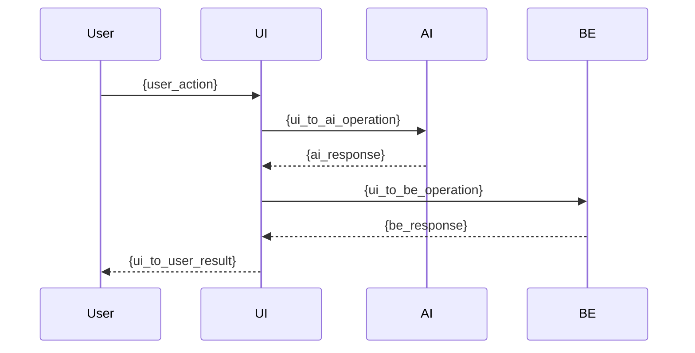
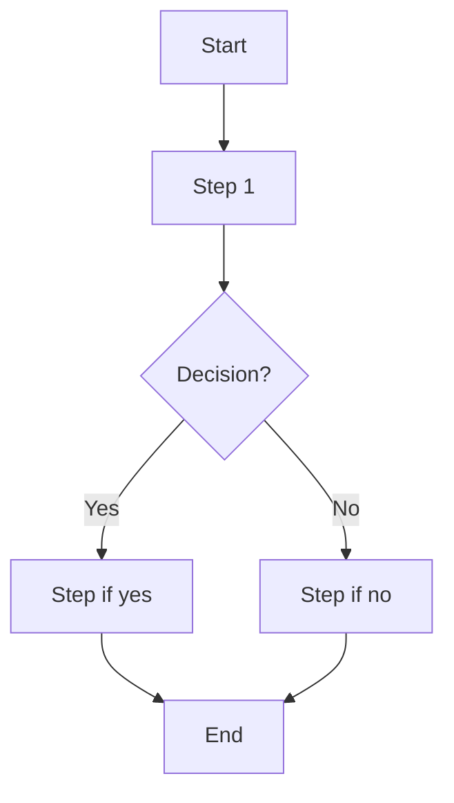

# Frontend User Story

Template for creating detailed frontend user stories with acceptance criteria, UI/UX specs, and metrics.

Fill in the sections below to register a frontend user story with full specs.

## Objective (User Story)

- **As a (user role / persona):** {user_role}  
- **I want (specific objective):** {specific_objective}  
- **So that (benefit and value):** {benefit_and_value}  

## Acceptance Criteria

### Happy Path Scenario

```gherkin
Scenario: {success_scenario_name}
  Given {pre_condition}
  And {additional_pre_condition}
  When {action}
  Then {expected_result}
  And {additional_result}
  And {result_details}:
    | field  | value  |
    | field1 | value1 |
    | field2 | value2 |
```

### Corner Cases (optional)

```gherkin
Scenario: {edge_case_name}
  Given {pre_condition}
  When {action}
  Then {expected_result}
  And error code {error_code}
  And reason {error_reason}
```

### Error Cases (optional)

```gherkin
Scenario: {error_scenario_name}
  Given {error_pre_condition}
  When {error_action}
  Then the system should return {error_expected}
  And error code {error_code}
  And reason {error_reason}
```

## Domain Entities and Schemas (optional)

### Entity: {Entity_Name}

| Screen Field (pt-BR) | Backend Field | Type  | Description  |
|----------------------|---------------|-------|--------------|
| field1               | field1        | type1 | description1 |
| field2               | field2        | type2 | description2 |
| field3               | field3        | type3 | description3 |

## Metrics (optional)

- **Business:** {business_metric_1}, {business_metric_2}
- **Performance:** {performance_metric_1}, {performance_metric_2}
- **UI/UX:** {ui_ux_metric_1}, {ui_ux_metric_2}
- **SLIs / SLOs:** {sli_slo_item_1}, {sli_slo_item_2}

## Sequence Diagram (optional)



## Flowchart — User Journey (optional)



## Use Cases (optional)

### {Use_Case_Title}

**Scenario:** {scenario_description}  
**Challenge:** {challenge_description}  
**Solution:** {solution_description}  
**Benefit:** {benefit_description}

## Mockup / Prototype (optional)

Paste component code, image or Miro/Figma prototype link.

## References

- [Guardia Documentation](https://docs.guardia.finance/)
- {additional_reference}
