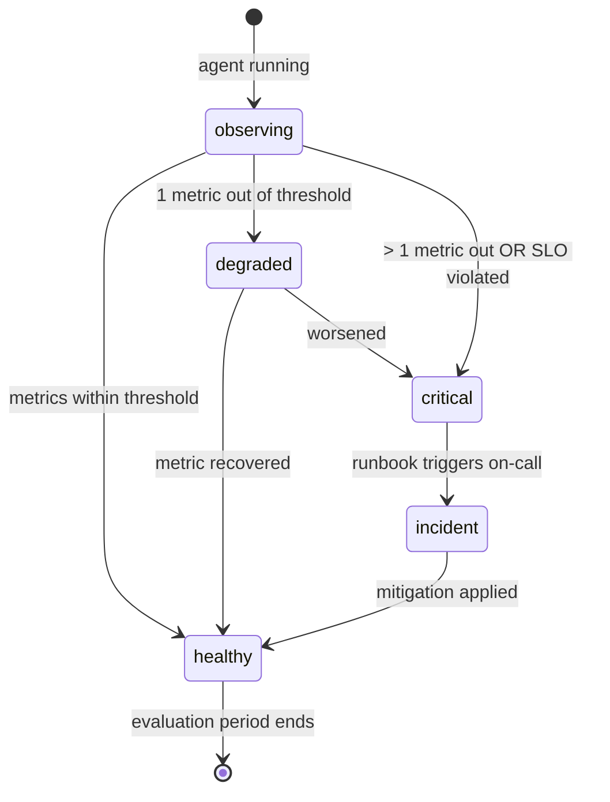

# Kata: Feedback Loop + Metrics Design (SLO when tier-1/2)

> **Prefix:** `kata-` | **Type:** Repeatable Skill | **Scope:** Engineering — Agents: design of the agent's feedback loop (`feedback.md`) and operational metrics (`metrics.md`) in `operational-concrete`

## Objective

Produce two canonical files:

- `feedback.md` — feedback modalities (HITL for irreversible actions, critic LLM, objective metrics), triggers, remedial actions
- `metrics.md` — operational metrics catalog + (when `tier-1` or `tier-2`) declared SLO per `lex-slo-required`

Strictly covers **Directive 04 — Explicit Feedback Loop** of `lex-agent-construction-directives`. In tier-1/2 it also satisfies the obligation recorded by `kata-dooc-validate::Step 9`.

## When to Use

- After `kata-agent-memory-design` (metrics observe memory layers)
- When the agent needs an SLO revision (tier change, threshold change, new runbook)

## Inputs

| Input | Required | Description |
|-------|:--------:|-------------|
| `context` | Yes | Bounded Context |
| `agent` | Yes | Agent slug |
| `overview_path` | Yes | `docs/{context}/agents/{agent}/overview.md` (tier + lagging metric + leading metric) |
| `dooc_path` | Yes | `docs/{context}/dooc/{agent}.md` (item h — tier) |
| `--from-pov <path>` | No | PoV path; inherits already-proven value metrics |

## Workflow

```
Progress:
- [ ] 1. Read overview + dooc + (optional) PoV
- [ ] 2. Declare feedback modalities (HITL + critic + metrics)
- [ ] 3. Declare ≥ 3 objective metrics
- [ ] 4. When tier-1/2: declare SLO + error budget policy
- [ ] 5. Declare runbook(s) per lex-runbook-for-every-alert
- [ ] 6. Final validation
```

### Step 1: Read overview + dooc + (optional) PoV

1. Read `overview.md` for tier, leading metric, lagging metric
2. Read `dooc/{agent}.md` to confirm tier and capture PoV leading-metric evidence
3. In `with-pov`, read `pov-path/feedback.md` and `pov-path/observability/value-metrics.md` — inherit metrics that proved value

### Step 2: Declare feedback modalities

Template `feedback.md`:

```markdown
# Feedback Loop — {agent}

> **Bounded Context:** {context}
> **Agent:** {agent}
> **Tier:** {tier}

## Modalities

### HITL (Human-in-the-Loop) for irreversible actions

Every action that produces an irreversible effect MUST go through human confirmation. Catalog:

| Action | Trigger | Who confirms | Response SLA |
|--------|---------|--------------|--------------|
| `create_erp_journal` | Agent output recommends creation | Accountant owner | 4 business hours |
| `send_customer_email` | Output requires communication | On-call operator | 1 business hour |

When there is no confirmation within the SLA → escalation via `escalation.md`.

### Critic LLM

When the agent uses the `reflexion` pattern or tier-1/2 with quality > latency, a critic model reviews the output before returning. Configuration:

- **Model:** {critic LLM name}
- **Acceptance threshold:** {value}
- **Orchestrator stage that invokes:** {reference to orchestrator.md::Workflow}
- **Action on rejection:** {retry with refinement | escalate to human | abort with error}

### Objective metrics (≥ 3 required)

Metrics that quantitatively close the learning loop. Listed in detail in `metrics.md`. Each metric MUST have:

- Canonical name (snake_case)
- Operational definition (how measured at runtime)
- Threshold (expected production value)
- Evaluation window
- Remedial action on deviation

## Loop states



## Pivot triggers

Conditions that trigger structural revision of the agent (scope change, model retraining, demotion to `pre-operational`):

- Leading metric < threshold for ≥ 2 consecutive cycles
- Pivot trigger pre-declared in PoV `value-proof.md`
- Lagging metric does not improve after {N} days

A pivot MUST be recorded in an ADR.

## References

- `lex-agent-construction-directives::Directive 04`
- `metrics.md` — metrics catalog + SLO
- `orchestrator.md` — runtime feedback integration points
- `escalation.md` — escalation path when feedback fails
- `lex-slo-required` (tier-1/2)
- `lex-runbook-for-every-alert`
```

### Step 3: Declare ≥ 3 objective metrics

Template `metrics.md`:

```markdown
# Metrics — {agent}

> **Bounded Context:** {context}
> **Agent:** {agent}
> **Tier:** {tier}
> **SLO required:** yes (tier-1/2) | no (tier-3/4)

## Catalog

### `{metric_name_1}` (LEADING — source: DoOC item b)

- **Definition:** {how measured}
- **Type:** counter | gauge | histogram
- **Unit:** {%, ms, count}
- **Threshold:** {value}
- **Window:** {duration}
- **Source:** {span/log/decorator name}
- **Action on deviation:** {pivot trigger | degradation alert | incident}

### `{metric_name_2}` (LAGGING — source: DoOC item c)

(idem)

### `{metric_name_3}` (operational — latency, error)

(idem)

## SLO (required tier-1/2)

> **Applicability:** this SLO file exists when `tier ∈ {tier-1, tier-2}`. For tier-3/4, omit this section.

```yaml
service: {agent}
tier: tier-1 | tier-2
slos:
  - name: availability
    sli: "successful_runs / total_runs (excluding 4xx user-error)"
    objective: 99.9% (tier-1) | 99.5% (tier-2)
    window: 30d
    error_budget_policy: "pause features when ≥ 80% consumed"
  - name: latency_p99
    sli: "agent_turn_duration_seconds{p99}"
    objective: {N}s
    window: 30d
  - name: quality (when measurable)
    sli: "critic_acceptance_rate OR human_approval_rate"
    objective: {%}
    window: 7d
owners:
  - team: {team-name}
    escalation: "@on-call-handle | #channel"
```

> For tier-3/4, declare `SLO: none — best effort` and omit the YAML block.

## Runbooks

Each critical alert MUST have a runbook (per `lex-runbook-for-every-alert`):

| Alert | Runbook |
|-------|---------|
| `{agent}-availability-breach` | `docs/runbooks/{agent}-availability-breach.md` |
| `{agent}-p99-breach` | `docs/runbooks/{agent}-p99-breach.md` |

## Instrumentation

Per `lex-observability-required`:

- 1 trace per agent turn (span `agent.turn`)
- ≥ 1 latency metric (histogram)
- Structured log with `correlation_id`, `org_id`, `client_id`, `agent_id`, `outcome`
- `traceparent` propagation to downstream tools

Implementation via centralized decorator per `lex-logging-decorator`.

## References

- `lex-slo-required`, `lex-observability-required`, `lex-runbook-for-every-alert`
- `feedback.md` — feedback modalities that consume these metrics
- `orchestrator.md::Runtime feedback loop`
- `lex-logging-decorator`
```

### Step 4: When tier-1/2, declare SLO + error budget policy

Required checks:

1. SLO YAML block present in `metrics.md`
2. ≥ 2 SLOs declared (availability + latency minimum)
3. Error budget policy declared (pause features when ≥ 80% consumed)
4. Owners + escalation channel populated (no placeholders)

### Step 5: Declare runbook(s)

For each critical alert (availability breach, latency breach, error rate breach):

1. Create an entry in `metrics.md::Runbooks`
2. Create a placeholder file at `docs/runbooks/{agent}-{alert-name}.md` (template per `lex-runbook-for-every-alert`)
3. Confirm that the alert config (CloudWatch, Datadog, or equivalent) has `runbook_url` pointing to the path

### Final Validation

- [ ] `feedback.md` declares HITL for irreversible actions (concrete catalog)
- [ ] ≥ 3 objective metrics declared in `metrics.md`
- [ ] When tier-1/2: SLO declared with error budget policy
- [ ] Runbooks listed for each critical alert
- [ ] Explicit pivot triggers in `feedback.md`
- [ ] Instrumentation per `lex-observability-required` (trace + metric + log) present

## Outputs

| Output | Format | Destination |
|--------|--------|-------------|
| `feedback.md` | Markdown | `docs/{context}/agents/{agent}/feedback.md` |
| `metrics.md` | Markdown | `docs/{context}/agents/{agent}/metrics.md` |
| `docs/runbooks/{agent}-*.md` | Markdown | placeholders created when alerts declared |

## Constraints

- HITL for irreversible actions is REQUIRED (non-negotiable)
- < 3 objective metrics violates Directive 04
- tier-1/2 without SLO violates `lex-slo-required`
- An alert without a runbook violates `lex-runbook-for-every-alert`
- Missing pivot trigger in agents with a PoV is prohibited (the PoV declared the trigger; the same trigger MUST exist in production)

---

**Model:** The Kata produces feedback + metrics. In tier-1/2, declares the SLO. Each alert has a runbook. Strict cross-link with `lex-observability-required` and `lex-slo-required`.
