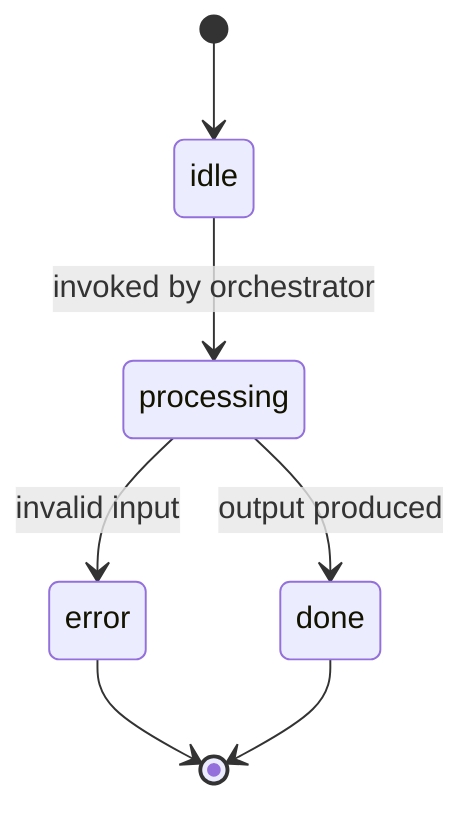

# Kata: Specialists Design (with Delegation to Theseus when Applicable)

> **Prefix:** `kata-` | **Type:** Repeatable Skill | **Scope:** Engineering — Agents: design of specialist sub-agents of the agent in `operational-concrete`, producing `specialists/{name}.md`

## Objective

Produce the canonical files of each specialist of the agent (maximum 5 per `kata-agent-orchestrator-design`). When specialists map to domain aggregates (DDD), **delegate to `warrior-theseus`** via wrapper to ensure boundaries aligned with the domain model. When there is no parallel with aggregates, the Kata produces the specialists directly.

Covers the cognitive structural part of **Directive 01 — Clear Identity** (each specialist has a sub-identity aligned with the agent's) and of **Directive 05 — Restricted Scope** (each specialist has a much narrower scope than the agent's).

## When to Use

- After `kata-agent-orchestrator-design` declares `Specialists declared` with ≥ 2 entries
- Not executed when the orchestrator declares `no specialist` (the orchestrator does everything)

## Inputs

| Input | Required | Description |
|-------|:--------:|-------------|
| `context` | Yes | Bounded Context |
| `agent` | Yes | Agent slug |
| `orchestrator_path` | Yes | `docs/{context}/agents/{agent}/orchestrator.md` |
| `specialists` | Yes | List of specialists declared by the orchestrator (with name + optional target aggregate) |
| `--from-pov <path>` | No | PoV path; specialists may inherit boundaries proven in the PoV |
| `domain_path` | No | `docs/{context}/entities/` to check alignment with existing aggregates |

## Workflow

```
Progress:
- [ ] 1. Read orchestrator + specialists list
- [ ] 2. For each specialist: evaluate aggregate mapping
- [ ] 3. When it maps: delegate to Theseus (kata-domain-model wrapper)
- [ ] 4. When it does not map: draft specialist directly
- [ ] 5. Validate boundaries between specialists (no overlap)
- [ ] 6. Final validation
```

### Step 1: Read orchestrator + specialists list

1. Load `orchestrator.md::Specialists declared`
2. Load `orchestrator.md::States (between specialists)` to understand expected handoffs
3. For each specialist, identify: name, scope declared by the orchestrator, target aggregate (when declared)

### Step 2: For each specialist, evaluate aggregate mapping

Mapping criterion:

| Signal | Decision |
|--------|----------|
| Specialist operates over a canonical entity from `docs/{context}/entities/` (e.g., `Transaction`, `Account`) | Maps to aggregate → delegate to Theseus |
| Specialist represents a cross-cutting sub-use case (e.g., "description normalization") | Does not map → produce directly |
| Specialist is a technical capability (e.g., "PDF OCR") | Does not map → produce directly |

When in doubt, prefer delegation to Theseus — he may decline when it does not fit.

### Step 3: When it maps, delegate to Theseus

Invocation:

```
Agent → warrior-theseus
  via kata-domain-model
  input:
    - context: {context}
    - aggregate-root: {Aggregate}
    - source: docs/{context}/entities/{entity}.md (existing) OR PoV-derived
    - usage: specialist of agent {agent}
  expected output:
    - aggregate boundary validation
    - list of entities + value objects + invariants
    - list of aggregate errors per lex-error-handling
```

Theseus returns the aggregate spec (in `docs/{context}/entities/{entity}.md` if it does not yet exist). The Kata then transcribes the specialist `specialists/{name}.md` referencing the aggregate.

### Step 4: When it does not map, produce directly

Canonical template for `specialists/{name}.md`:

```markdown
# Specialist — {SpecialistName}

> **Bounded Context:** {context}
> **Agent owner:** `{agent}`
> **Target aggregate:** `{Aggregate}` (path) | N/A — technical capability
> **Source of truth:** the agent's `system-prompt.md` defines parent identity; this file refines scope

## Why it exists

{1-3 sentences describing the cognitive sub-task the specialist isolates. Why isolating makes sense — distinct scope, distinct tools, distinct states.}

## Responsibilities

### Does

- {Responsibility 1}
- {Responsibility 2}

### Does not

- {Exclusion 1 — e.g.: does not call write tools; another specialist is responsible}
- {Exclusion 2}

## States



## Workflow with tools

| Stage | What it does | Tools used | Memory |
|-------|--------------|------------|--------|
| 1. Validate input | Checks `org_id`/`client_id` + payload schema | (none) | short |
| 2. {Stage N} | {} | {} | {} |
| 3. Produce output | Formats payload for the orchestrator | (none) | short |

## Tools consumed (subset)

| Tool | Why | Idempotent |
|------|-----|------------|
| `{tool-name}` | {} | yes/no |

Cross-link `tools.md` for detail.

## Memory consumed (subset)

- **Short:** current session
- **Medium:** {when consumed}
- **Long:** {when consumed}

Cross-link `memory.md`.

## Errors emitted

| Code | Reason | When |
|------|--------|------|
| `ERR400_INVALID_PARAMETER` | `INVALID_TRANSACTION_FORMAT` | input outside schema |
| `ERR422_VALIDATION_FAILED` | `AMBIGUOUS_MATCH` | match cannot be disambiguated |

Cross-link `lex-error-handling` + `codex-known-errors`.

## References

- `orchestrator.md` — parent orchestrator
- `system-prompt.md` — agent's canonical identity
- `tools.md` — full tool catalog
- `memory.md` — memory layers
- `docs/{context}/entities/{Aggregate}.md` (when there is a target aggregate)
```

### Step 5: Validate boundaries between specialists

For each pair of specialists `(A, B)`:

1. Verify there is no overlap in `Does` (duplicated responsibility between A and B)
2. Verify that the states in `orchestrator.md::States (between specialists)` cover all possible handoffs between A and B
3. Verify that each error emitted by A is handled by A or the orchestrator, not by B (coupling between specialists via errors is an antipattern)

When overlap exists, escalate to human review — it may indicate the split was premature or that an intermediate specialist is missing.

### Final Validation

- [ ] Number of specialists in [2, 5]; 0 or 1 violates orchestrator decision; > 5 violates scope
- [ ] Each specialist has a clear `Why it exists` (not empty)
- [ ] Specialists that map to an aggregate reference a path in `docs/{context}/entities/`
- [ ] Boundaries between specialists do not overlap in `Does`
- [ ] Each specialist declares tools (subset of `tools.md`) and memory (subset of `memory.md`) consumed
- [ ] When delegation to Theseus exists, the invocation is recorded (PR ref or commit ref)

## Outputs

| Output | Format | Destination |
|--------|--------|-------------|
| `specialists/{name}.md` (1 per specialist) | Markdown | `docs/{context}/agents/{agent}/specialists/{name}.md` |
| Updates in `docs/{context}/entities/` | Markdown | when Theseus created or adjusted aggregates |

## Example Execution

For `rec-classifier`, the orchestrator declared 2 specialists:

1. `statement-parser` — technical capability (does not map to an aggregate; produced directly)
2. `category-matcher` — maps to aggregate `TransactionCategory` (delegated to Theseus, who returns the aggregate spec, then the Kata transcribes the specialist)

Final output:

```
docs/reconciliation/agents/rec-classifier/specialists/
├── statement-parser.md
└── category-matcher.md

docs/reconciliation/entities/
└── transaction-category.md  (updated by Theseus)
```

## Constraints

- Do not create a specialist without `Why it exists`
- Do not allow overlap in `Does` between specialists
- Do not create a specialist that duplicates an orchestrator capability
- Theseus is the authority on aggregate boundaries; when he declines the mapping, the specialist is produced directly

---

**Model:** The Kata produces specialists with sharp boundaries. Delegates to Theseus when applicable; produces directly when there is no parallel with the domain. Always runs after `kata-agent-orchestrator-design` declares ≥ 2 specialists.
