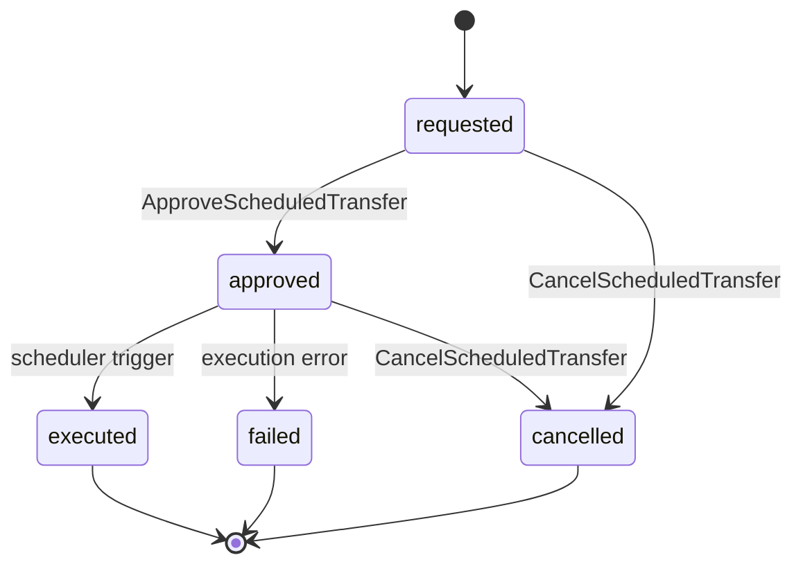

# Codex: Feature Design Documents — Structure and Templates

> **Prefix:** `codex-` | **Type:** Reference Manual | **Scope:** Guardia platform — templates and conventions for documents produced in the feature design cycle

## Overview

This Codex is the canonical manual for feature design documents on the Guardia platform. It defines the folder structure inside `docs/`, the template for each category, and the conventions that `warrior-prometheus`, `warrior-theseus`, `warrior-daedalus`, `warrior-kronos` and any agent producing these documents MUST follow. The corresponding Law is in `lex-feature-design-docs`.

## Context

- **Domain:** organization of feature design artifacts on the Guardia platform
- **Audience:** design warriors, human authors, PR reviewers
- **Update:** on any change to structure or templates (ADR required when changing a reserved category)

## Canonical Structure

```
docs/
└── {context}/                  # Bounded Context in kebab-case
    ├── entities/
    │   └── {entity-name}.md
    ├── oas/
    │   └── openapi.yaml
    ├── events/
    │   └── events.md
    ├── agents/                 # reserved
    └── metrics/                # reserved
```

### Conventions

| Item | Rule |
|------|------|
| `{context}` | Bounded Context in kebab-case. e.g. `ScheduledPayments` → `scheduled-payments` |
| Files in `entities/` | kebab-case derived from PascalCase. e.g. `ScheduledTransfer` → `scheduled-transfer.md` |
| File in `oas/` | `openapi.yaml`; when multiple APIs: `openapi-{slug}.yaml` |
| File in `events/` | `events.md` |
| Language | per `language.default` in `.ahrena/.directives` |

## Templates

### 1. `entities/{entity-name}.md`

Each entity in the Bounded Context has a **dedicated file** under `docs/{context}/entities/`. Template:

````markdown
# Entity: {EntityName}

> **DDD Classification:** Entity | Aggregate Root | Value Object
> **Bounded Context:** {context}
> **entity_type:** `{UPPER_SNAKE_CASE}`

## Why it exists

{Describe in 2 to 4 sentences why the entity exists in the domain. Focus on the business problem it solves, not the technical schema. Example: "Represents a bank transfer ordered by an accountant for execution on a future date. Exists to separate intent (scheduling) from execution (processing) and to allow the mandatory supervisor approval cycle."}

## Fields

| Field | Type | Size | Required | Description |
|-------|------|------|:--------:|-------------|
| `entity_id` | UUID v7 | 36 | Yes | Unique entity identifier (lex-entities) |
| `entity_type` | string | — | Yes | Fixed value: `{UPPER_SNAKE_CASE}` |
| `version` | integer | — | Yes | Optimistic version |
| `created_at` | datetime (ISO 8601) | — | Yes | Created |
| `updated_at` | datetime (ISO 8601) | — | Yes | Last update |
| `discarded_at` | datetime (ISO 8601) | — | No | Soft delete (lex-entities) |
| `{business_field}` | {type} | {size} | Yes/No | {Functional description} |

> **Type:** use canonical types: `string`, `integer`, `decimal`, `boolean`, `datetime`, `date`, `enum<...>`, `UUID v7`, `Money`, `array<...>`, `object<...>`, or reference to another Entity/VO.
> **Size:** maximum length (string), precision (decimal), or `—` when not applicable.
> **Required:** Yes when the field is required to create the entity; No when optional.

## Business Rules

List numerically the business rules that govern the entity in domain language (not SQL/code).

1. **{BR-1 — short name}:** {full rule in one sentence. e.g.: "A transfer can only be scheduled for business days up to 90 days in the future."}
2. **{BR-2}:** {...}
3. **{BR-3}:** {...}

## Invariants

Invariants are conditions that **always hold** for the entity or aggregate. They differ from business rules in that they admit no exception in any state.

- **{INV-1}:** {e.g.: "`amount` is always strictly positive."}
- **{INV-2}:** {e.g.: "`status` only transitions through the states defined in the diagram."}
- **{INV-3}:** {e.g.: "An `executed` transfer can never go back to `requested`."}

## Relationships

| Relation | Cardinality | Type | Target Entity | Note |
|----------|-------------|------|---------------|------|
| owns | 1..N | composition | `{OtherEntity}` | {e.g.: "ScheduledTransfer owns 1..N TransferApproval"} |
| references | N..1 | reference | `{OtherEntity}` | {e.g.: "References Account by entity_id; does not compose."} |

> Use `composition` when the target entity only exists via the root; `reference` when the target has an independent lifecycle.

## Errors

Errors emitted by use cases that touch this entity. Each error MUST follow `lex-error-handling` (code, reason, message).

| Code | Reason | Message | When it occurs |
|------|--------|---------|----------------|
| `ERR400_INVALID_PARAMETER` | `INVALID_SCHEDULED_DATE` | "scheduled_date must be a future business day" | {BR-1 violated} |
| `ERR409_CONFLICT` | `INVALID_STATE_TRANSITION` | "transfer cannot move from {from} to {to}" | Invalid transition attempt |

## References

- `lex-entities` — required base structure
- `lex-entity-naming` — UPPER_SNAKE_CASE for entity_type; snake_case for fields; PascalCase in DDD documents
- `lex-error-handling` — error format
- `docs/{context}/events/events.md` — events emitted by this entity
- `docs/{context}/oas/openapi.yaml` — REST endpoints exposing this entity
````

### 2. `oas/openapi.yaml`

The Bounded Context OpenAPI 3.x specification follows `codex-oas-structure` in full. The file `oas/openapi.yaml` is canonical. Minimum skeleton:

```yaml
openapi: 3.0.3
info:
  title: {Bounded Context} API
  version: 0.1.0
  description: |
    REST API of the {context} bounded context. This specification is the source of truth
    for the endpoints exposed by the entities in docs/{context}/entities/.
  contact:
    name: Guardia Platform
servers:
  - url: https://api.guardia.com
    description: Production
  - url: https://api.staging.guardia.com
    description: Staging

tags:
  - name: {EntityName}
    description: Operations on {EntityName}

paths:
  /v1/{resource}:
    get:
      summary: List {resource}
      operationId: list{Resource}
      tags: [{EntityName}]
      parameters:
        - $ref: '#/components/parameters/PageSize'
        - $ref: '#/components/parameters/PageToken'
      responses:
        '200':
          description: OK
          content:
            application/json:
              schema:
                $ref: '#/components/schemas/{Resource}List'

components:
  parameters:
    PageSize: { ... }
    PageToken: { ... }
  schemas:
    {Resource}: { ... }
    {Resource}List: { ... }
  securitySchemes:
    bearerAuth:
      type: http
      scheme: bearer
      bearerFormat: JWT
```

> Complementary guidelines: operation order per resource (`POST → GET list → GET item → PATCH → DELETE`), use `$ref` for reusable schemas, canonical pagination parameters (`page_size`, `page_token`) per `codex-restful-pagination`, and required headers (`Idempotency-Key`, `X-Grd-Trace-Id`) per `codex-restful-headers`.

### 3. `events/events.md`

Documents **all events of the Bounded Context**, organized by entity. For each entity, a Mermaid state diagram and, for each event, the payload in CloudEvents format.

````markdown
# Events — {Bounded Context}

> **Bounded Context:** {context}
> **CloudEvents Module:** `{module}` (segment `{module}` in `event.guardia.{module}.{entity_name}.{event_name}`, where `{entity_name}` is the lowercase form of `entity_type` per `lex-entity-naming` Rule 5)

## Overview

2-4 sentence summary of the events published by this context and their main consumers.

## Catalog

| entity_type | event_name | full type | Publisher | Consumers |
|-------------|------------|-----------|-----------|-----------|
| `SCHEDULED_TRANSFER` | `requested` | `event.guardia.financial.scheduled_transfer.requested` | ScheduledPayments | Approval, Audit |
| `SCHEDULED_TRANSFER` | `approved` | `event.guardia.financial.scheduled_transfer.approved` | Approval | ScheduledPayments, Audit |
| `SCHEDULED_TRANSFER` | `executed` | `event.guardia.financial.scheduled_transfer.executed` | BankingIntegration | ScheduledPayments, Ledger |

---

## {EntityNameInPascalCase}

> `entity_type`: `{UPPER_SNAKE_CASE}`

### Lifecycle



### Events

#### `event.guardia.{module}.{entity_name}.requested`

> Emitted when the user creates the entity.

```json
{
  "specversion": "1.0",
  "id": "txn:01b1c2d3-e4f5-7a8b-9c0d-1e2f3a4b5c6d",
  "source": "https://api.guardia.technology/financial/v1/scheduled-transfers/txn:01957f3e-a1b2-7c8d-9e0f-1a2b3c4d5e6f",
  "type": "event.guardia.financial.scheduled_transfer.requested",
  "subject": "SCHEDULED_TRANSFER/txn:01957f3e-a1b2-7c8d-9e0f-1a2b3c4d5e6f",
  "time": "2026-04-26T10:00:00Z",
  "datacontenttype": "application/json",
  "idempotencykey": "txn:01957f3e-a1b2-7c8d-9e0f-1a2b3c4d5e6f",
  "data": {
    "entity_id": "txn:01957f3e-a1b2-7c8d-9e0f-1a2b3c4d5e6f",
    "entity_type": "SCHEDULED_TRANSFER",
    "version": 1,
    "created_at": "2026-04-26T10:00:00Z",
    "updated_at": "2026-04-26T10:00:00Z",
    "scheduled_date": "2026-04-30",
    "amount": 100000,
    "currency": "BRL",
    "source_account_id": "...",
    "target_account_id": "..."
  }
}
```

| `data` field | Type | Required | Description |
|--------------|------|:--------:|-------------|
| `entity_id` | UUID v7 | Yes | Entity identifier |
| `entity_type` | string | Yes | Always `{UPPER_SNAKE_CASE}` |
| `scheduled_date` | date | Yes | Scheduled execution date |
| `amount` | integer (cents) | Yes | Value in the currency's smallest unit |
| `currency` | string (ISO 4217) | Yes | Currency code |

**Idempotency:** `idempotencykey` equal to the `entity_id` of the originating request.
**Trigger:** Use Case `RequestScheduledTransfer`.

---

#### `event.guardia.{module}.{entity_name}.approved`

> Emitted when supervisor approves.

```json
{ ... full payload ... }
```

| Field | Type | Required | Description |
|-------|------|:--------:|-------------|

**Trigger:** Use Case `ApproveScheduledTransfer`.

---

(repeat for each event of the entity)

---

## {OtherEntity}

(repeats the structure: lifecycle → events with payload)

## References

- `lex-cloudevents`, `codex-cloudevents` — CloudEvents format
- `lex-entity-naming` — snake_case in CloudEvents type segments
- `lex-idempotency` — required `idempotencykey`
- `docs/{context}/entities/` — entities that emit these events
````

### 4. `agents/` — reserved

Reserved to document agents (Isac, automations, integrations) that act on this context. Structure to be defined in a future round.

### 5. `metrics/` — reserved

Reserved for SLI/SLO, dashboards and product/operations metrics of the context. Structure to be defined in a future round, aligned to `lex-slo-required` and `lex-observability-required`.

## Cross-References

The three document types reference each other:

| From → To | Reference |
|-----------|-----------|
| `entities/{e}.md` → `events/events.md` | Lists the events emitted by the entity in *References* |
| `entities/{e}.md` → `oas/openapi.yaml` | Lists the REST endpoints that expose the entity |
| `events/events.md` → `entities/` | Each entity section in events.md references the entity file |
| `oas/openapi.yaml` → `entities/` | Schemas mirror the entity field catalog |

Cross-consistency is verified by `warrior-prometheus` at the end of the cycle (Phase 4 — Consistency Verification).

## Restrictions

- **Do not invert the hierarchy:** always `docs/{context}/{category}/`. Category as the top level (`docs/entities/{context}/...`) is FORBIDDEN.
- **Do not duplicate entity field in event payload:** the payload references the entity catalog; only fields relevant to the event are reproduced.
- **Do not create a single "domain" file:** the domain model is distributed across `entities/` (tables and rules), `events/` (lifecycle) and `oas/` (exposed contract). The monolithic `domain-model.md` is deprecated.
- **Do not use configurable paths:** `paths.domain`, `paths.oas`, `paths.events` were removed from `.ahrena/.directives`. The structure is fixed and codified in this Lexis/Codex.

## References

- `lex-feature-design-docs` — corresponding Law
- `kata-feature-design-docs` — operational procedure
- `lex-entities`, `codex-entities` — entity base structure
- `lex-entity-naming` — naming conventions
- `lex-cloudevents`, `codex-cloudevents` — events
- `codex-oas-structure` — OpenAPI structure
- `codex-restful-payload`, `codex-restful-headers`, `codex-restful-pagination` — REST conventions
- `warrior-prometheus`, `warrior-theseus`, `warrior-daedalus`, `warrior-kronos` — agents that produce these documents
