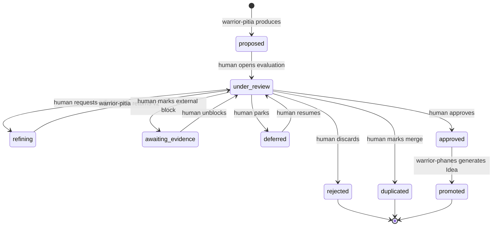

# Codex: Product Discovery Artifacts — Insights and Ideas

> **Prefix:** `codex-` | **Type:** Reference Manual | **Scope:** Product Discovery — schema, lifecycle, and governance of `insights/*.md` and `ideas/*.md` artifacts

## Canonical addressing

The execution artifacts produced by Pitia and Phanes live in:

```
docs/
└── discovery/
    └── {topic}/                   # topic in kebab-case (e.g., scheduled-payments-research)
        ├── insights/
        │   └── {NNN}-{slug}.md    # NNN sequential within the topic, zero-padded
        └── ideas/
            └── {NNN}-{slug}.md    # NNN sequential within the topic, zero-padded
```

### Conventions

| Item | Rule |
|------|------|
| `{topic}` | Theme of the Discovery initiative in kebab-case. E.g.: `accountant-onboarding`, `scheduled-payments-research` |
| `{NNN}` | Sequential number **within the topic**, zero-padded with 3 digits (`001`, `002`, …, `099`, `100`). No gaps |
| `{slug}` | Short kebab-case summary of the insight/idea content. E.g.: `manual-reconciliation-bottleneck` |
| Language | Per `language.default` in `.ahrena/.directives` |
| Files per insight/idea | **One file per artifact** — enables PR-per-insight and granular review |

## Insight schema

Each `docs/discovery/{topic}/insights/{NNN}-{slug}.md` file MUST contain YAML front-matter followed by free Markdown body.

```yaml
---
id: "{topic}/insights/{NNN}-{slug}"
topic: "{topic}"
status: proposed
source_refs:
  - "https://figma.com/file/abc123"
  - "notion://page-id"
  - "docs/transcripts/interview-2026-05-04-accountant-X.md"
tags:
  - reconciliation
  - manual-process
created_at: "2026-05-06T10:00:00Z"
updated_at: "2026-05-06T10:00:00Z"
# Fields populated according to state machine transitions:
merged_into: null              # filled when status: duplicated → "{topic}/insights/{NNN}-{slug}"
idea_ref: null                 # filled when status: promoted → "{topic}/ideas/{NNN}-{slug}"
rejected_reason: null          # filled when status: rejected
awaiting_evidence_reason: null # filled when status: awaiting_evidence
---

# Insight: {Human Title in English}

## Observation

{What was observed, in direct language. 2 to 5 sentences.}

## Source

{Where it came from: which API/doc/interview/process. Quote excerpts when possible.}

## Initial implication

{Why this matters to the business. Do not propose a solution yet — Idea comes later.}

## Open questions

{List of questions that need additional evidence to mature this insight.}
```

### Front-matter fields

| Field | Type | Required | Description |
|-------|------|:--------:|-------------|
| `id` | string | Yes | Stable identifier: `{topic}/insights/{NNN}-{slug}` |
| `topic` | string | Yes | Topic in kebab-case (same as the parent directory) |
| `status` | enum | Yes | One of the 9 status values in the state machine (see below) |
| `source_refs` | array&lt;string&gt; | Yes (≥1) | URLs or paths of the consulted sources |
| `tags` | array&lt;string&gt; | No | Tags for search/aggregation |
| `created_at` | datetime ISO 8601 | Yes | Creation date |
| `updated_at` | datetime ISO 8601 | Yes | Last update |
| `merged_into` | string \| null | Conditional | When `status: duplicated` — reference to the canonical insight |
| `idea_ref` | string \| null | Conditional | When `status: promoted` — reference to the generated Idea |
| `rejected_reason` | string \| null | Conditional | When `status: rejected` — short reason |
| `awaiting_evidence_reason` | string \| null | Conditional | When `status: awaiting_evidence` — what is missing |

## Idea schema

Each `docs/discovery/{topic}/ideas/{NNN}-{slug}.md` file MUST contain YAML front-matter with the 5 mandatory Idea fields.

```yaml
---
id: "{topic}/ideas/{NNN}-{slug}"
topic: "{topic}"
problem: "Accountants lose on average 4h/week manually reconciling divergent entries between the ERP and the bank statement."
hypothesis: "If the system suggests automatic reconciliation with ≥90% confidence, accountants will accept the suggestion in ≥70% of cases, reducing manual time by ≥60%."
target_user: "Operational accountant in firms with 50-500 active clients"
success_metric: "Average reconciliation time per month per client: baseline 4h → target 1.5h in 90 days after release"
effort_estimate: "M (2-4 sprints; depends on integration with ERP X and the matching model)"
linked_insights:
  - "{topic}/insights/001-manual-reconciliation-bottleneck"
  - "{topic}/insights/003-erp-divergence-patterns"
created_at: "2026-05-10T15:00:00Z"
updated_at: "2026-05-10T15:00:00Z"
---

# Idea: {Human Title in English}

## Synthesis

{2 to 4 sentences connecting the problem to the hypothesis and the user.}

## Source insights

{Numbered list referencing each insight in `linked_insights[]` with a 1-sentence summary.}

## Next steps

{Suggestions for additional validation before the design cycle (e.g., confirmatory interview, proof of concept, telemetry data analysis). This is not a priority decision — that belongs to `warrior-prometheus`.}
```

### Front-matter fields

| Field | Type | Required | Description |
|-------|------|:--------:|-------------|
| `id` | string | Yes | Stable identifier: `{topic}/ideas/{NNN}-{slug}` |
| `topic` | string | Yes | Topic in kebab-case (MUST match the `topic` of the insights in `linked_insights[]`) |
| `problem` | string | Yes | Concrete observed problem, in one sentence. No embedded solution |
| `hypothesis` | string | Yes | Testable hypothesis: "If X, then Y, measured by Z" |
| `target_user` | string | Yes | Specific target user (not "all users") |
| `success_metric` | string | Yes | Leading or lagging metric with baseline and target |
| `effort_estimate` | enum | Yes | `XS` \| `S` \| `M` \| `L` \| `XL` with justification in parentheses |
| `linked_insights` | array&lt;string&gt; | Yes (≥1) | IDs of source insights; all with `topic` equal to the Idea's |
| `created_at` | datetime ISO 8601 | Yes | Creation date |
| `updated_at` | datetime ISO 8601 | Yes | Last update |

The 5 content fields (`problem`, `hypothesis`, `target_user`, `success_metric`, `effort_estimate`) are the **5 mandatory preconditions** validated by HARD-GATE 1 of `lex-discovery-flow`.

## Insight state machine



### Transition table

| From → To | Who moves | Precondition | Side effect |
|-----------|-----------|--------------|-------------|
| `[*]` → `proposed` | `warrior-pitia` | Synthesis from `source_refs[]` ≥ 1 | Creates the insight file |
| `proposed` → `under_review` | human | — | — |
| `under_review` → `refining` | human | Actionable feedback provided | — |
| `refining` → `under_review` | `warrior-pitia` | Insight v2 written | `updated_at` updated |
| `under_review` → `awaiting_evidence` | human | `awaiting_evidence_reason` filled | — |
| `awaiting_evidence` → `under_review` | human | Evidence obtained | `awaiting_evidence_reason` cleared |
| `under_review` → `deferred` | human | — | — |
| `deferred` → `under_review` | human | — | — |
| `under_review` → `duplicated` | human | `merged_into` points to another insight in the same topic | Canonical insight receives a note |
| `under_review` → `rejected` | human | `rejected_reason` filled | Terminal |
| `under_review` → `approved` | human | — | Available for `warrior-phanes` |
| `approved` → `promoted` | `warrior-phanes` | HARD-GATE 1 of `lex-discovery-flow` met | Idea file created; `idea_ref` filled |

Terminal states: `rejected`, `duplicated`, `promoted`. Non-terminal states that look terminal: `deferred` (returns to `under_review` when unblocked).

## Restrictions

- **`id` immutability:** once created, `id` never changes. If an insight is renamed, mark the old one as `duplicated` pointing to the new one.
- **Do not invert the hierarchy:** always `docs/discovery/{topic}/{insights|ideas}/`. Category as the top level (`docs/discovery/insights/{topic}/...`) is FORBIDDEN.
- **Do not consolidate multiple insights in one file:** one insight per file, even if related — use `linked_insights[]` in the Idea to aggregate.
- **Idea without source insight:** FORBIDDEN in v1. If an Idea legitimately arises from research not documented as an insight, first create the insight, then the Idea.
- **`topic` does not change between insight and Idea:** the Idea's `topic` MUST match the `topic` of all its `linked_insights[]`.
