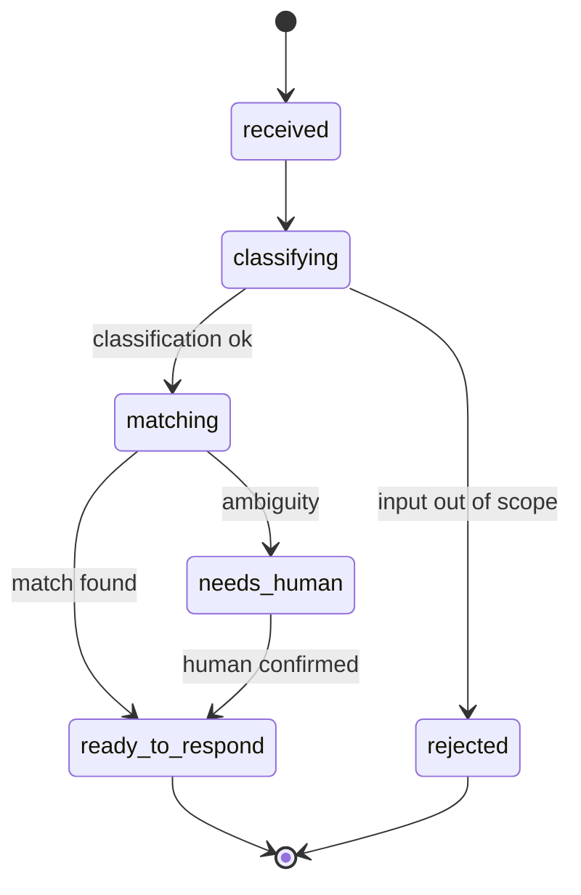
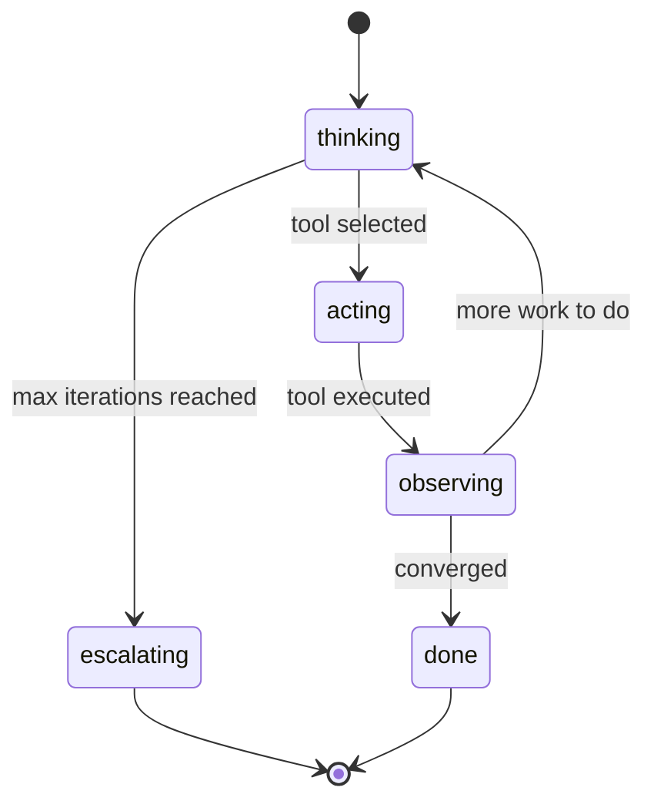

# Kata: Orchestrator and Reasoning Loop Design

> **Prefix:** `kata-` | **Type:** Repeatable Skill | **Scope:** Engineering — Agents: design of the agent's orchestrator in `operational-concrete`, producing `orchestrator.md` and `reasoning-loop.md`

## Workflow

```
Progress:
- [ ] 1. Read overview + system-prompt + (optional) PoV
- [ ] 2. Choose reasoning pattern (with justification)
- [ ] 3. Decide specialists (1, several, or none)
- [ ] 4. Draft orchestrator.md (persona, scope, states, workflow)
- [ ] 5. Draft reasoning-loop.md (pattern, states, parameters)
- [ ] 6. Final validation
```

### Step 1: Read overview + system-prompt + (optional) PoV

1. Load `overview.md` to extract primary use case and out-of-scope
2. Load `system-prompt.md` to extract blocks 2 (capabilities + boundaries) and 3 (reasoning style)
3. In `with-pov`, read `pov-path/system-prompt.md` and any notes about PoV states — inherit when applicable, refine for production rigor

### Step 2: Choose reasoning pattern

| Pattern | When to use | When NOT to use |
|---------|-------------|-----------------|
| `tool-calling-simple` | Agent with 1-3 tools and 1 deterministic cycle (input → tool → response) | When you need to decompose into sub-tasks |
| `react` | Agent that iterates `Thought → Action → Observation` until convergence | In tasks with a fixed global plan (use plan-and-execute) |
| `plan-and-execute` | Agent that needs to decompose input into N explicit sub-tasks and execute in order | In single-shot tasks |
| `reflexion` | Agent that needs to self-review output before returning (quality > latency) | In tier-1 with tight latency SLO |

The choice MUST be justified in a dedicated section of `reasoning-loop.md`. Do not use a pattern without justification.

### Step 3: Decide specialists

Specialists are sub-agents invoked by the orchestrator when the task decomposes into distinct cognitive sub-domains. Rules:

- **0 specialists** — the orchestrator does everything. Acceptable when scope is narrow and the reasoning pattern is `tool-calling-simple` or `react`
- **1 specialist** — overkill in most cases; reconsider whether the abstraction makes sense
- **2-5 specialists** — normal case for `plan-and-execute`; each specialist has its own aggregate (delegation to `warrior-theseus` via `kata-agent-specialists-design`)
- **> 5 specialists** — signals that the agent's scope is too large; suggest splitting into two agents

Record the decision in `orchestrator.md` section `Specialists declared`. When ≥ 2 specialists, mark obligation to invoke `kata-agent-specialists-design` next.

### Step 4: Draft orchestrator.md

Canonical template:

```markdown
# Orchestrator — {agent}

> **Bounded Context:** {context}
> **Agent:** {agent}
> **Source of truth:** `system-prompt.md` defines identity; this file defines runtime orchestration.

## Persona

{Summarized persona of the orchestrator — it is the agent's "thread". Direct, aligned with `system-prompt.md::Block 1`.}

## Scope

- **Does:** orchestrates the reasoning cycle, dispatches tools, delegates to specialists, produces canonical output
- **Does not:** specialists' domain logic (delegated), direct persistence (delegated to tools), decisions about structural scope (human escalation via `escalation.md`)

## Specialists declared

| Specialist | Path | Aggregate (Theseus) |
|------------|------|---------------------|
| `{specialist-1}` | `specialists/{specialist-1}.md` | `{aggregate-name}` |
| `{specialist-2}` | `specialists/{specialist-2}.md` | `{aggregate-name}` |

> When 0 specialists: declare `Specialists declared: none (orchestrator does everything)`.

## States (between specialists)



> Replace with the actual diagram for the agent.

## Workflow (with tools and dependencies)

| Stage | What it does | Tools used | Specialist | Memory consumed | Possible errors |
|-------|--------------|------------|------------|-----------------|------------------|
| 1. Receive | Receives input, validates `org_id`/`client_id`, classifies intent | (none) | — | short | `ERR400_INVALID_PARAMETER` |
| 2. Classify | Decides which specialist to invoke | history search | classifier | medium | `ERR409_AMBIGUOUS_INTENT` |
| 3. Execute | Delegates to the appropriate specialist | (depends on specialist) | (variable) | (variable) | (variable) |
| 4. Self-review (optional, reflexion) | Verifies output before returning | critic LLM | — | (none) | — |
| 5. Respond | Applies output format | (none) | — | short | — |

## Runtime feedback loop

- **HITL for irreversible actions:** {list the actions requiring human confirmation — cross-link `feedback.md::HITL irreversibles`}
- **Critic LLM:** {invoked in which stages, model used, acceptance threshold}
- **Runtime metrics:** {names of metrics emitted via observability decorator — cross-link `metrics.md`}

## Loop states



> Replace with the actual diagram of the chosen pattern.

## Operational parameters

| Parameter | Value | Justification |
|-----------|-------|---------------|
| `max_iterations` | {N} | trade-off latency × completeness |
| `timeout_per_step` | {N}s | per declared SLO (tier-1/2) |
| `temperature` | {0.0 - 1.0} | determinism required for reconciliation |
| `top_p` | {0.0 - 1.0} | |
| `fallback_action` | {action} | e.g., `escalate_to_human` when max iterations exceeded |

## Chaining with other files

- **Identity loaded:** reads `system-prompt.md` at boot (immutable snapshot during the session)
- **Memory consumed by state:**
  - `thinking`: short + medium
  - `acting`: none (the tool consumes what it needs)
  - `observing`: short + (optional long)
- **Tools dispatched:** see `tools.md`
- **Feedback emitted:** see `feedback.md` + `metrics.md`

## Outputs

| Output | Format | Destination |
|--------|--------|-------------|
| `orchestrator.md` | Markdown | `docs/{context}/agents/{agent}/orchestrator.md` |
| `reasoning-loop.md` | Markdown | `docs/{context}/agents/{agent}/reasoning-loop.md` |

## Constraints

- `orchestrator.md` does NOT contain the full prompt — it references `system-prompt.md`
- `reasoning-loop.md` does NOT duplicate the orchestrator's workflow — it stays restricted to the internal loop
- Reasoning pattern without justification is prohibited
- > 5 specialists requires human escalation via `escalation.md::Escalation Criteria`

---

**Model:** The Kata produces the agent's orchestration structure + reasoning loop. Decides whether specialists are needed and prepares handoff to `kata-agent-specialists-design` when applicable.
