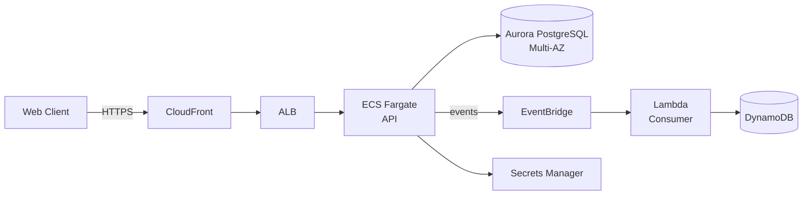

# Kata: Design AWS Architecture

> **Prefix:** `kata-` | **Type:** Repeatable Skill | **Scope:** AWS architecture design for a new feature, system, or workload — service selection, diagram, IaC, cost estimate, and risk analysis

## Workflow

```
Progress:
- [ ] 1. Clarify requirements and restrictions
- [ ] 2. Map data, flows, and interactions
- [ ] 3. Choose services per Well-Architected pillar
- [ ] 4. Draw architecture diagram
- [ ] 5. Analyze risks and alternatives
- [ ] 6. Estimate monthly cost
- [ ] 7. Generate IaC scaffolding
- [ ] 8. Produce architecture document
```

### Step 1: Clarify requirements and restrictions

Consult `.ahrena/.directives` and ask questions in batches:

1. **Expected traffic:** peak and average (requests/s, GB/month); pattern (constant, spiky, diurnal)?
2. **Required latency:** p50, p95, p99?
3. **Availability (SLA):** 99% (~3.65 days/year), 99.9% (~8.76h), 99.99% (~52min)?
4. **RTO/RPO:** acceptable recovery time and maximum data loss?
5. **Sensitive data:** PII, PCI, health data? Applicable compliance?
6. **Multi-region?** Why (global latency vs DR)?
7. **Monthly budget:** approximate limit?
8. **External integrations:** third-party APIs, legacy database, SAP, etc.?
9. **Deadline:** urgency impacts the decision (e.g., migrate on-prem in 3 months vs 12)?

Without clear answers, the design becomes guesswork — escalate to the user.

### Step 2: Map data, flows, and interactions

1. **Logical components:** which modules/services compose the system? (e.g., refund API, events engine, admin dashboard)
2. **Data handled:** which entities, where they persist, what volume, what access pattern (read-heavy, write-heavy, OLTP vs OLAP)?
3. **Critical flows:** trace the data path in the happy path (e.g., client → ALB → API → DB → event → consumer)
4. **External interactions:** integration with Guardia core, payment providers, email, SMS, etc.
5. **Traffic patterns:** synchronous (request/response) vs asynchronous (queue/event)?

### Step 3: Choose services per Well-Architected pillar

Consult `codex-aws-services` and `codex-aws-well-architected`. For each component, answer:

| Pillar | Guiding question |
|---|---|
| **Security** | IAM needed? Encryption? Sensitive data? Public/private auth? |
| **Reliability** | Multi-AZ? Multi-region? Backup? Failover? |
| **Performance** | Latency? Expected scale? Serverless or provisioned? |
| **Cost** | Workload predictability? Do Savings Plans make sense? |
| **Operational** | Will the team operate via CI/CD? Does it need a lot of logging? |
| **Sustainability** | Graviton compatible? Low-carbon region? |

Record each service choice **and why** (and alternatives considered, for a possible ADR).

### Step 4: Draw architecture diagram

Produce a diagram in Mermaid or draw.io showing:

- Components (boxes with AWS icons)
- VPCs and subnets (private vs public)
- Data flows (arrows with protocol: HTTPS, SQL, gRPC)
- External integration (clouds or boxes outside the VPC)
- Multi-AZ/Multi-region if applicable

Mermaid example:



### Step 5: Analyze risks and alternatives

For key decisions, record:

| Decision | Chosen | Alternative | Trade-off |
|---|---|---|---|
| API Compute | ECS Fargate | Lambda | Fargate chosen for sustained traffic; Lambda would consider cold start |
| Primary DB | Aurora PostgreSQL | DynamoDB | Aurora for relational queries; DynamoDB for key-value patterns |
| Streaming | EventBridge | SNS+SQS | EventBridge for schema registry and advanced filtering |

Identify **technical risks**:

- Single points of failure
- Anticipated performance bottlenecks
- Critical external dependencies
- AWS service limits that may be hit

Each structural decision that affects multiple components or contracts **MUST generate an ADR** — invoke `kata-adr-write` (when in the Issue-Driven flow).

### Step 6: Estimate monthly cost

1. **AWS Pricing Calculator** for detailed estimation.
2. **Infracost** for Terraform integration.
3. Decompose by pillar:
   - Compute (ECS, Lambda, EC2)
   - Storage (S3, EBS, RDS storage)
   - Database (RDS compute, DynamoDB RCU/WCU, ElastiCache)
   - Network (NAT Gateway, data transfer, ALB hours)
   - Other (KMS, Secrets Manager, CloudWatch logs)
4. Consider **traffic peaks** and **failure scenarios** (multi-AZ failover momentarily doubles cost).
5. Compare to the informed budget — if it exceeds >20%, revisit choices.

### Step 7: Generate IaC scaffolding

Create an **initial skeleton** in Terraform or CDK (depending on the project's tool):

- Module for each main component (VPC, ECS, Aurora, etc.)
- Standardized tags (see `lex-aws-cost`)
- Placeholders for business values (capacities, retentions, sizes)
- References to secrets via Secrets Manager (values populated outside IaC, see `lex-aws-security`)

The scaffolding **does not need to be production-ready** — it is a starting point for the DevOps team to iterate on.

### Step 8: Produce architecture document

Structure (when in the Issue-Driven flow, this document **is part of** `.ahrena/issues/{n}/03-architecture.md` or referenced from it):

```markdown
# AWS Architecture — {system name}

## Context and Requirements
- Functional description
- Non-functional requirements (traffic, SLA, RTO/RPO, compliance)
- Restrictions

## Overview (Diagram)
```mermaid
...
```

## Components

### {Component Name}
- **AWS service:** ECS Fargate
- **Why:** sustained workload, Python containers, no K8s ops needed
- **Configuration:** 2 tasks by default, ALB, target tracking 70% CPU
- **Alternatives discarded:** Lambda (rejected: cold start on a critical synchronous endpoint)

### {...}

## Region Selection
- **Primary:** sa-east-1 (LGPD compliance + BR latency)
- **Fallback:** us-east-1 (failover for tier-1 workload)

## Security
- IAM roles specific per component
- KMS for storage encryption
- Secrets Manager for credentials
- WAF on CloudFront
- Private VPC + VPC Endpoints

## Reliability
- Multi-AZ for Aurora and ECS
- RTO: 1h / RPO: 5min
- Backup via AWS Backup with 90-day retention
- Quarterly chaos testing

## Performance
- Target latency p99: 300ms
- Auto-scaling by CPU + ALB target tracking
- CloudFront for static assets

## Cost Optimization
- 1-year Savings Plan for ECS (covers baseline)
- Spot for non-critical batch jobs
- S3 Intelligent-Tiering for logs bucket
- Monthly budget: US$ {X}

## ADRs Generated
- [ADR-{n}: {decision}](docs/adr/...)

## Cost Estimate
| Component | Monthly (USD) |
|---|---|
| ECS Fargate + ALB | 650 |
| Aurora (r6g.large Multi-AZ) | 540 |
| S3 + Data Transfer | 120 |
| NAT Gateway (2 AZ) | 65 |
| CloudWatch | 45 |
| Other | 80 |
| **Total** | **~1,500** |

## Risks and Mitigations
- **Risk:** seasonal peak (Black Friday) exceeds capacity
  - **Mitigation:** pre-scaling via schedule + raise max capacity in auto-scaling
- **Risk:** region failover = RTO outside SLA
  - **Mitigation:** pre-tested runbook; monitored replication lag

## IaC Scaffolding
- Location: `infra/modules/{system}/`
- Tool: Terraform
- Next steps: DevOps reviews, parameterizes, applies to staging
```

## Outputs

| Output | Format | Destination |
|--------|--------|-------------|
| Architecture document | Markdown | `.ahrena/issues/{n}/03-architecture.md` (or dedicated file) |
| Diagram | Embedded Mermaid or SVG/PNG | In the architecture document |
| ADRs | MADR Markdown | `docs/adr/ADR-*` (via `kata-adr-write`) |
| IaC scaffolding | `.tf` or `.ts` (CDK) files | `infra/modules/{system}/` or equivalent folder |
| Cost estimate | Table in the document + Pricing Calculator spreadsheet | Document + link |

## Restrictions

- **No skipping pillars:** the 6 Well-Architected dimensions must be considered even if briefly.
- **Justify choices:** each chosen service has a "why" + alternative considered.
- **Apply Lexis:** `lex-aws-security`, `lex-aws-iac`, `lex-aws-cost` are mandatory from the design stage.
- **Mandatory cost estimate:** architecture without cost is incomplete.
- **ADR for structural decisions:** don't leave critical decisions only in the document — they deserve an ADR.
