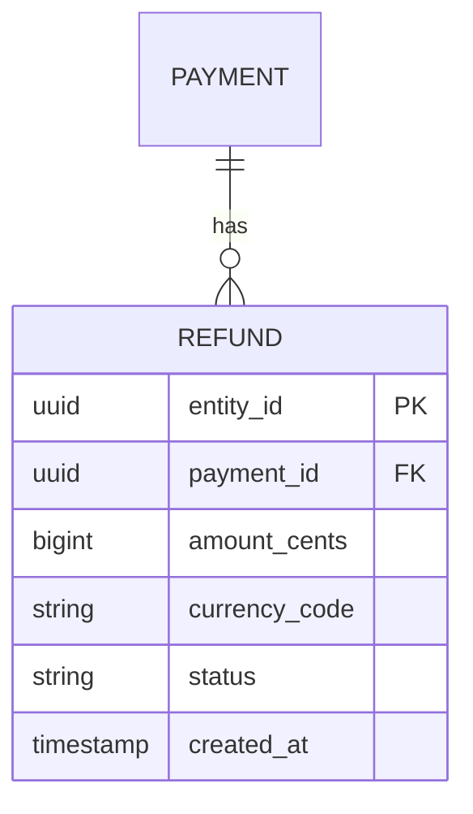
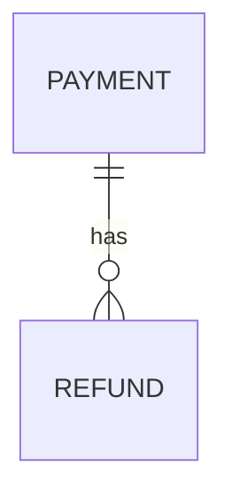

# Kata: Design Data Schema

> **Prefix:** `kata-` | **Type:** Repeatable Skill | **Scope:** Schema design for new entity, domain, or expansion of existing model — entities, relationships, indexes, migrations, retention

## Workflow

```
Progress:
- [ ] 1. Identify entities, value objects, aggregates
- [ ] 2. Model relationships and cardinalities
- [ ] 3. Decide relational vs. NoSQL
- [ ] 4. Define attributes and types
- [ ] 5. Define indexes for access patterns
- [ ] 6. Classify PII and retention policy
- [ ] 7. Migration strategy (if evolution)
- [ ] 8. Persist schema document
```

### Step 1: Entities, value objects, aggregates

Using `codex-data-modeling`:

- List entities with their own identity (`Refund`, `Payment`).
- Identify immutable value objects (`Money`, `Address`).
- Design aggregates: which entity is root; which are internal to the aggregate.

Rule: aggregate = transaction boundary. Small = greater concurrency.

### Step 2: Relationships

For each pair of entities:

- **1:1**: FK + unique constraint (consider merging into same table if always together).
- **1:N**: FK on the "many" entity.
- **N:M**: junction table with own attributes when there is relation metadata.
- **Polymorphic**: avoid; prefer separate tables or interface pattern.

Draw simple ER diagram in Mermaid:



### Step 3: Relational vs. NoSQL

Decision tree in `codex-data-modeling`:

- **Aurora PostgreSQL** is the default for Guardia (transactional OLTP).
- **DynamoDB** for known access patterns + massive scale.
- **Mixed** is valid (relational OLTP + read model in DynamoDB/OpenSearch).

If decision is non-trivial → ADR via `kata-adr-write`.

### Step 4: Attributes and types

For each entity:

- Ahrena base attributes (`codex-entities`): `entity_id`, `entity_type`, `version`, `created_at`, `updated_at`, `created_by`, `updated_by`.
- Specific fields with explicit type and constraints.
- Money: `amount_cents` (bigint) + `currency_code` (char(3)) — never float.
- Timestamps: always UTC (`timestamp with time zone` in Postgres, epoch in DynamoDB).
- Enums: validate in code + `CHECK` constraint in DB.

For each column, decide: NOT NULL? DEFAULT? UNIQUE?

### Step 5: Indexes

List main queries (access patterns):

```
Q1: list refunds by payment_id ordered by created_at DESC
Q2: find refund by idempotency_key (unique)
Q3: count refunds in last 24h for fraud rule
```

Derived indexes:

```sql
CREATE INDEX idx_refund_payment_created ON refund (payment_id, created_at DESC);
CREATE UNIQUE INDEX idx_refund_idempotency ON refund (idempotency_key);
-- Q3 can use Q1 index (prefix (created_at DESC)) or need another
```

Check with `EXPLAIN` when possible.

### Step 6: PII and retention

Classify each column:

| Column | Class | Retention |
|---|---|---|
| `entity_id` | system | 7y (audit) |
| `customer_cpf` | PII | LGPD — soft delete 5y inactive |
| `amount_cents` | transactional | 7y (legal) |
| `notes` (free text) | potential PII | avoid free; if necessary, 90d retention |

Update `docs/data-retention.yaml` (`lex-data-retention`).

### Step 7: Migration (if evolution)

If it is evolution of existing schema, apply expand-contract (`lex-migrations-reversible`):

1. **Expand**: ADD COLUMN nullable; code writes in both.
2. **Backfill**: job in batches.
3. **Cut-over**: code uses only new.
4. **Contract**: DROP or NOT NULL applied.

Estimate duration per phase; if any exceeds 10min in prod, detail strategy (pg_repack, window).

### Step 8: Persist schema document

Structure in `.ahrena/issues/{n}/03b-schema.md` (complements architecture.md):

```markdown
# Schema — Issue #{n}: {title}

## Entities

### Refund (aggregate root)

| Column | Type | Constraints | Notes |
|---|---|---|---|
| entity_id | UUID | PK | v4 |
| payment_id | UUID | FK → payment.entity_id, NOT NULL | |
| amount_cents | BIGINT | NOT NULL, CHECK > 0 | |
| idempotency_key | TEXT | UNIQUE | |
| ... | ... | ... | ... |

## Relationships



## Indexes

| Name | Columns | Reason |
|---|---|---|
| idx_refund_payment_created | (payment_id, created_at DESC) | Q1 (list by payment) |
| ... | ... | ... |

## PII and retention

| Column | Class | Retention |
|---|---|---|

## Migration

(if applicable, expand-contract)

## Decision: DB

Aurora PostgreSQL (OLTP) + Redis cache for idempotency lookups.

Referenced ADR: docs/adr/ADR-XXX-aurora-for-refund.md
```

## Outputs

| Output | Format | Destination |
|--------|--------|-------------|
| Schema document | Markdown | `.ahrena/issues/{n}/03b-schema.md` |
| ER diagram | Embedded Mermaid | In the document |
| Retention update | YAML | `docs/data-retention.yaml` |
| ADR (if necessary) | MADR Markdown | `docs/adr/ADR-*` |

## Restrictions

- **No over-design**: if entity is simple, do not force aggregate pattern.
- **Mandatory base attributes**: always `entity_id`, `created_at`, `updated_at`.
- **Justified indexes**: each index has documented access pattern; do not speculate.
- **Declared retention**: each new table updates `docs/data-retention.yaml`.
